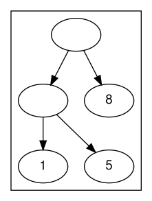

trick or tree'ing
=================

As described on [DMOJ](https://dmoj.ca/problem/dwite12c1p4)


## Description

You just moved into a strange neighbourhood. You notice that the roads
in your neighbourhood form a binary tree, with the houses forming the
leaves of the tree. But this doesn't really matter to you, because it's
all about the candy during Halloween! However having just moved in, you
might end up getting lost. So you create a plan: start at the root of
your neighbourhood and walk to every house and ask for candy! Before
setting off on your adventure however, you want to calculate the minimum
number of roads you'll need to walk and the total amount of candy you'll
get.

The input will contain 5 test cases. Each test case is a line containing
a single string, less than 256 characters long, describing the tree
your neighbourhood forms. A binary tree can be recursively described as
either:

    A leaf c , 1 ≤ c ≤ 20 , the amount of candy received from the
    house ( t t ) - where t represents a tree

For example, a tree represented by ( ( 1 5 ) 8 ) would look like:



The output will contain 5 lines of output, each a pair of integers R and
C . R is the minimum number of roads needed to be traversed to get all
the candy (starting from the root (top) of the tree, and not needing to
return). C represents the total amount of candy you'll collect.


## Sample Input 
```
((1 5) 8)
(1 3)
```

## Sample Output 
```
6 14 
3 4
```
